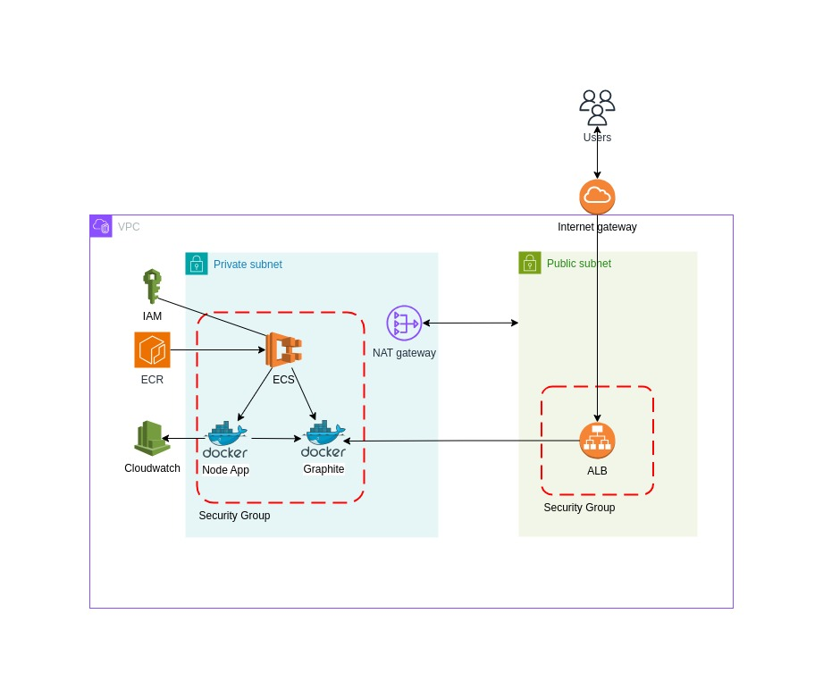

## Cloud Infrastructure Diagram

The following diagram represents the cloud infrastructure for our application:



## Project Structure

The project is organized into several Terraform configuration files to ensure clarity and maintainability:

- **`main.tf`**: Defines the core infrastructure components, including the VPC, ECS cluster, task definitions, services, security groups, and load balancer.
- **`variables.tf`**: Contains all the variables used across the Terraform configurations, allowing for easy customization and environment-specific settings.
- **`providers.tf`**: Configures the required providers, including AWS and Docker, which are necessary to build and deploy the application.
- **`outputs.tf`**: (Optional) Outputs key information after the deployment, such as the ECS cluster name and the load balancer DNS.

### Code Overview

This section provides a detailed explanation of the Terraform configuration, focusing on what each component does and the reasoning behind specific design choices.

#### VPC Module

The VPC (Virtual Private Cloud) is created using the Terraform AWS VPC module. This module provisions a secure and isolated network environment for your ECS cluster. The VPC is configured with the following features:

- **Private and Public Subnets**: Separate subnets are created for public and private resources, allowing for secure communication between the components. The private subnets host the ECS tasks, while the public subnets are used by the Application Load Balancer (ALB).
  
- **NAT Gateway**: A single NAT gateway is deployed to enable instances in the private subnets to access the internet for updates and other outbound traffic, without exposing them directly to the internet.
  
- **DNS Support**: DNS support and hostnames are enabled within the VPC, facilitating easy resolution of internal services by name.

The design ensures that the application components are isolated and secure, with controlled access to the internet and other AWS services.

#### ECR Repository

An Amazon Elastic Container Registry (ECR) repository is provisioned to store Docker images for your application. The ECR repository is configured with:

- **Image Scanning**: Automatic scanning on image push is enabled to detect vulnerabilities, ensuring that only secure images are deployed to your ECS cluster.
  
- **Versioning**: The Docker image is tagged with an incremented version number, derived from a local version file. This ensures that each deployment uses a uniquely identifiable image, facilitating rollback and debugging.

This setup provides a secure, version-controlled repository for your application's container images.

#### IAM Roles

Two IAM roles are defined to manage permissions for the ECS tasks:

- **ECS Execution Role**: This role grants ECS tasks the necessary permissions to pull images from ECR and write logs to AWS CloudWatch. It is essential for ensuring that the ECS tasks can access the resources they need to run effectively.
  
- **ECS Task Role**: This role grants permissions to the tasks running within the ECS service, allowing them to interact with other AWS services as required by the application. The role is attached to the task definition to ensure that the necessary permissions are in place.

These roles are tightly scoped to minimize permissions and follow the principle of least privilege.

#### ECS Cluster and Task Definitions

An ECS cluster is created to host the application, which consists of two containers: the Node.js application and a Graphite metrics backend. The ECS task definition includes:

- **Container Definitions**: The Node.js application and Graphite are defined as separate containers within the same task. Resource allocations (CPU and memory) are specified to ensure that each container has the necessary resources to function correctly.
  
- **Logging**: AWS CloudWatch Logs is configured as the logging driver, capturing logs from both containers and storing them in a centralized location for monitoring and troubleshooting.
  
- **Networking**: The task is configured to use the `awsvpc` network mode, which provides each task with its own network interface, allowing for fine-grained control over network traffic.

This configuration ensures that both containers are co-located within the same ECS task, simplifying networking and resource management.

#### ECS Service

The ECS service is responsible for maintaining the desired number of task instances across the ECS cluster. It is configured with:

- **Fargate Launch Type**: The service uses Fargate, a serverless compute engine for containers, which abstracts away the underlying infrastructure management, allowing you to focus on application development.
  
- **Load Balancing**: The service is integrated with an Application Load Balancer (ALB) to distribute incoming HTTP traffic to the Graphite container. The Node.js application is not exposed directly to the internet, enhancing security.

- **Auto-Scaling**: The service is set up to scale based on the desired count, ensuring high availability and reliability of the application.

This service configuration ensures that your application is scalable, highly available, and easy to manage.

#### Security Groups

Security groups are defined to control access to the ECS tasks and ALB:

- **ECS Service Security Group**: Controls inbound and outbound traffic for the ECS tasks. Inbound rules are restricted to internal VPC traffic for the Node.js application and allow public access to the Graphite metrics on specific ports.
  
- **ALB Security Group**: Controls traffic to and from the Application Load Balancer, allowing HTTP traffic from the internet on port 80.

These security groups are designed to minimize exposure to external threats while allowing necessary communication between components.

#### Application Load Balancer (ALB)

An Application Load Balancer is provisioned to manage incoming traffic:

- **Public Access**: The ALB is configured to be accessible from the internet, forwarding HTTP requests to the Graphite container. This setup allows you to access the Graphite metrics dashboard publicly.
  
- **Target Group**: The ALB forwards traffic to the ECS service using a target group. The target group is configured to route traffic to the appropriate container port in the ECS tasks.

The ALB ensures that your application can handle varying levels of traffic with high availability and fault tolerance.

## Workspaces and tfvars

Terraform workspaces are used to manage different environments (`dev`, `uat`, `prod`) within the same project. Each workspace has its own set of variables defined in corresponding `tfvars` files (e.g., `dev.tfvars`, `uat.tfvars`, `prod.tfvars`). These variables control environment-specific settings, such as VPC CIDR blocks, subnets, and ECS task definitions.

### Setting Up Workspaces

To set up and manage different environments, you need to create and select the appropriate workspace before applying the Terraform configuration. Here’s how to do it:

```bash
# Initialize Terraform (if not already initialized)
terraform init

# Create and select the `dev` workspace
terraform workspace new dev

# Create and select the `uat` workspace
terraform workspace new uat

# Create and select the `prod` workspace
terraform workspace new prod
```

### Applying the Configuration

Once the workspace is selected, you can apply the Terraform configuration using the corresponding `tfvars` file. This will provision the infrastructure tailored to the selected environment.

```bash
# Select the dev workspace
terraform workspace select dev

# Apply the configuration with the dev.tfvars file
terraform apply -var-file="dev.tfvars"
```